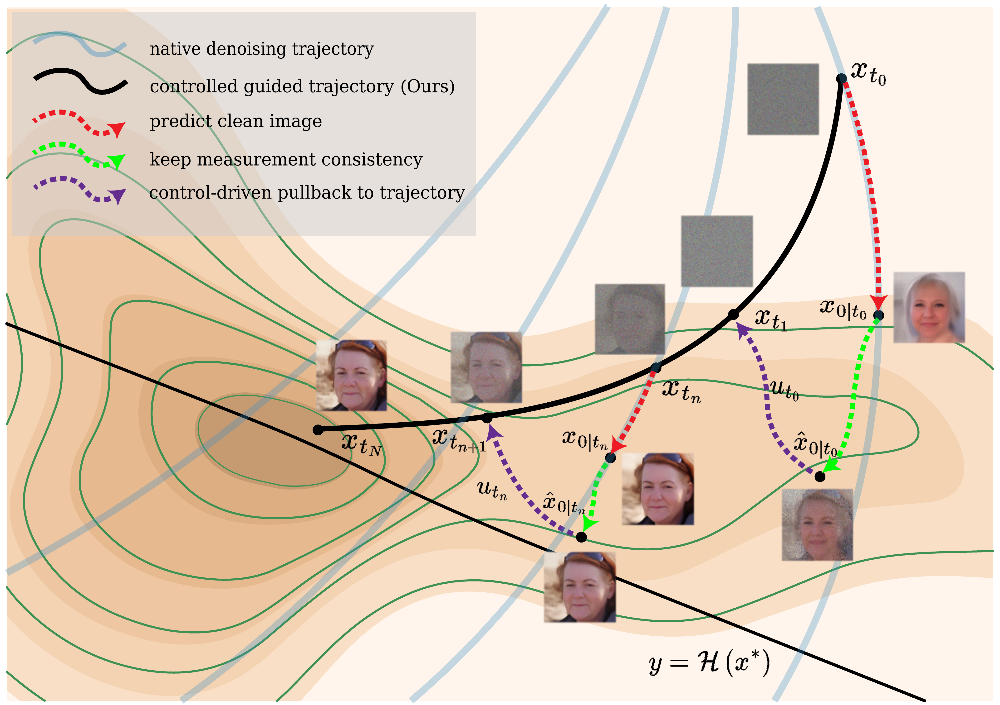
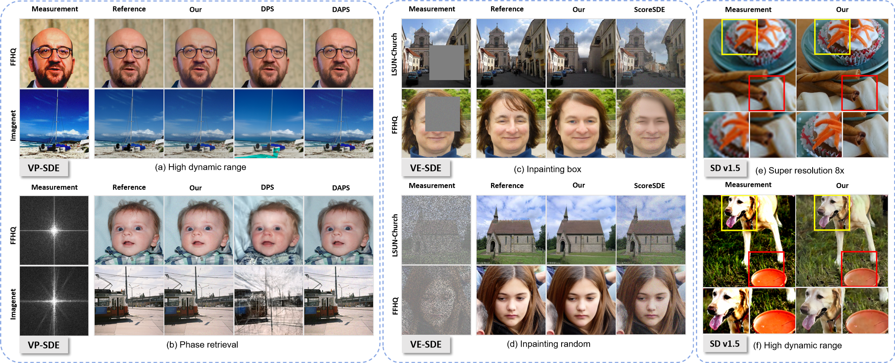

# Stochastic Optimal Control Sampling for Diffusion Inverse Problems

<center>

</center>

## Abstract
Benefiting from the strong ability to capture data distributions, diffusion models have become powerful tools for solving image inverse problems. The key is to controllably steer the sampling trajectory toward the measurements while respecting the diffusion prior. In this work, we introduce Stochastic Optimal Control Sampling (SOCS), which models the denoising process as a dynamical system and injects control signals via SOC. Previous SOC-based approach addresses inverse problems by optimizing over the entire trajectory, which is computationally expensive. In contrast, we derive a closed-form control update and apply it at each sampling step, pulling the measurement-consistent clean prediction back onto the denoising flow. In SOCS, we can readily modulate the control strength to align with the diffusion model’s native capabilities and thereby enhance perceptual quality. Our method is compatible with a variety of linear stochastic differential equation backbones. Extensive experiments across a broad spectrum of image inverse tasks demonstrate that SOCS achieves accurate measurement-aligned reconstructions with improved visual fidelity and stronger quantitative performance.

<center>

</center>

## Getting started 

### 1) Clone the repository

```
cd Stochastic-Optimal-Control-Sampling
```

### 2) Download pretrained checkpoint
From the [link](https://drive.google.com/drive/folders/1jElnRoFv7b31fG0v6pTSQkelbSX3xGZh?usp=sharing), download the checkpoint `ffhq_10m.pt` and `imagenet256.pt` and paste them to `./models/`
```
mkdir models
mv {DOWNLOAD_DIR}/ffqh_10m.pt ./models/
mv {DOWNLOAD_DIR}/imagenet256.pt ./models/
```
{DOWNLOAD_DIR} is the directory that you downloaded checkpoint to.


### 3) Set environment
### Local environment setting
Note that we use the external codes for [motion-blurring](https://github.com/VinAIResearch/blur-kernel-space-exploring) and [non-linear deblurring](https://github.com/LeviBorodenko/motionblur). You need to download an additional `GOPRO_wVAE.pth` file and place it in `./bkse/experiments/pretrained` for the non-linear deblurring task.
```
——— Stochastic-Optimal-Control-Sampling
 |——— bkse
   |——— experiments
   | |——— pretrained
   |   |——— GOPRO_wVAE.pth
   |...
 |——— configs
 |——— data
 |——— guided_diffusion
 |——— model
 |——— models
   |——— ffhq_10m.pt
   |——— imagenet256.pt
 |——— motionblur
 |...
```


Install dependencies

```
conda create -n SOCS python=3.8
conda activate SOCS
pip install -r requirements.txt
pip install torch==1.11.0+cu113 torchvision==0.12.0+cu113 torchaudio==0.11.0 --extra-index-url https://download.pytorch.org/whl/cu113
```

### 4) Inference
For inference on the FFHQ dataset, run the following command in the terminal, where `Solve_Type` can be chosen from `linear`, `nonlinear`, and `nonlinear_finitegamma`. The `gamma` parameter is used to modulate the magnitude of the control signal in the `nonlinear_finitegamma` setting.

```
python3 sample_condition.py \
--model_config=configs/model_ffhq_config.yaml \
--dataset ffhq \
--diffusion_config=configs/diffusion_soc_config.yaml \
--task_config=configs/{TASK-CONFIG}.yaml \
--solve_type {Solve_Type} \
--gamma 1e7
```

## Possible task configurations

```
# Linear inverse problems
- gaussian_deblur_soc_config.yaml
- inpainting_soc_config.yaml
- motion_deblur_soc_config.yaml
- super_resolution_inpainting_soc_config.yaml
- super_resolution_soc_config.yaml

# Nonlinear inverse problems
- high_dynamic_range_soc_config.yaml
- nonlinear_deblur_soc_config.yaml
- phase_retrieval_soc_config.yaml
```